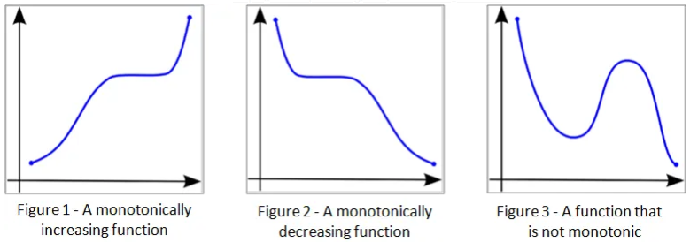

# Math Basics

Basic mathematical principles and concepts relevant for machine learning.

## Monotone function

A monotone function, also known as a monotonic function, is a function whose value is either always increasing or always decreasing with $x$. 

A function $f(x)$ is said to be **monotonically increasing** if, for any two points $x_1$​ and $x_2$​ in its domain, $x_1 < x_2$ implies that $f(x_1) \le f(x_2)$. This means that as $x$ increases, $f(x)$ does not decrease.

A function $f(x)$ is said to be **monotonically decreasing** if, for any two points $x_1$​ and $x_2$​ in its domain, $x_1 < x_2$ implies that $f(x_1) \ge f(x_2)$. This means that as $x$ increases, $f(x)$ does not increase.

## Dense *vs* sparse matrices

The terms "dense matrix" and "sparse matrix" are used to describe matrices based on the distribution of non-zero elements within the matrix.

A dense matrix is a matrix in which a significant portion of its elements are non-zero. In other words, it has a relatively high density of non-zero entries. 

A sparse matrix is a matrix in which the majority of its elements are zero. Sparse matrices arise in various applications, such as graph representation, scientific computing, and large-scale data analysis, where the data is often sparse. Storing and manipulating sparse matrices efficiently can save memory and computational resources.

The main difference between dense and sparse matrices lies in the way they are stored and the computational algorithms used to operate on them. Dense matrices are typically stored as a contiguous block of memory, allowing for efficient random access to elements. On the other hand, sparse matrices employ specialized data structures (e.g., compressed sparse row or column formats) to store only the non-zero elements and their corresponding indices, which reduces memory requirements and enables efficient operations on sparse data.

When choosing between dense and sparse matrices, it depends on the characteristics of the problem and the nature of the data. Dense matrices are suitable when the matrix is small or moderately sized, and the majority of elements are non-zero. Sparse matrices are useful when dealing with large-scale problems or datasets where most of the elements are zero, and computational and memory efficiency are crucial considerations.