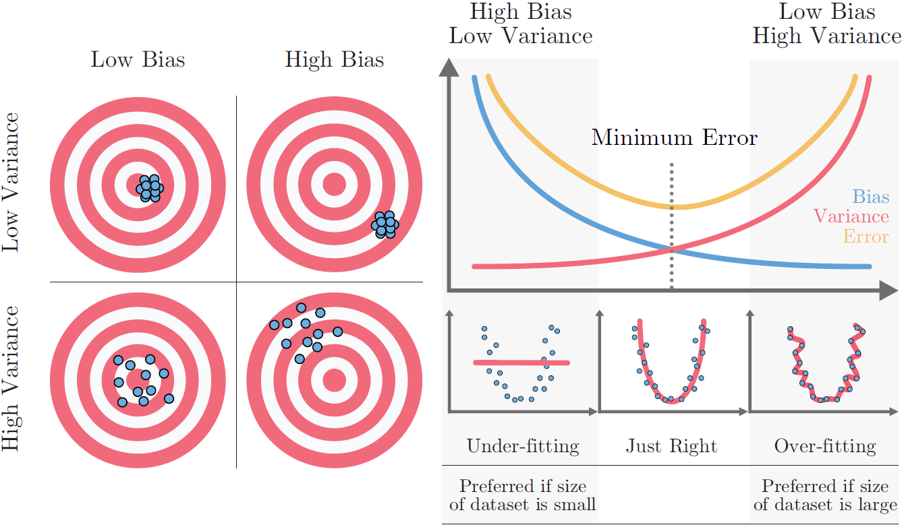

# Machine Learning Basics

## Types of ML systems

Several criteria may be used to group ML systems.

Whether they are trained under human supervision:

- Supervised
- Unsupervised 
- Semisupervised 
- Reinforcement Learning

Whether they learn incrementally:

- Online
- Batch

Whether they work by comparing new data points to known data points, or instead detect patterns in the training data and build a predictive model, much like scientists do:

- Instance-based
- Model-based learning 

## Supervised/unsupervised

### Supervised learning

The training set you feed to the algorithm includes the desired solutions (labels). Example: classification.
Regression algorithms can be used for classification as well, and vice-versa. For example, Logistic Regression is commonly used for classification, as it can output a value that corresponds to the probability of belonging to a given class.

Examples: 
- k-Nearest Neighbors
- Linear Regression
- Logistic Regression
- Support Vector Machines (SVMs)
- Decision Trees and Random Forests
- Neural networks (can be other types too)

### Unsupervised learning

Training data is not labeled.

Examples: 
- Clustering 
	- K-Means
	- DBSCAN
	- Hierarchical Cluster Analysis (HCA)
- Anomaly detection and novelty detection 
	- One class SVM
	- Isolation Forest
- Visualization and dimensionality reduction
	- Principal Component Analysis (PCA)
	- Kernel PCA
	- Locally-Linear Embedding (LLE)
	- t-distributed Stochastic Neighbor Embedding (t-SNE)
- Association rule learning
	- Apriori
	- Eclat

### Semisupervised learning

Some data is labeled, other is not. Some algorithms can deal with this. They are usually combinations of supervised and unsupervised algorithms.

Examples:
- Deep belief networks (DBNs) - based on unsupervised components called restricted Boltzmann machines (RBMs) stacked on top of one another. RBMs are trained sequentially in an unsupervised manner, and then the whole system is fine-tuned using supervised learning techniques

### Reinforcement learning

Completely different. The system learn by itself the best policy to improve.

## Bias-Variance Tradeoff

What is bias?
- Error between average model prediction and ground truth.
- The bias of the estimated function tells us the capacity of the underlying model to predict the values.

High bias might mean:
- Overly-simplified Model
- Under-fitting
- High error on both test and train data

What is variance?
- Average variability in the model prediction for the given dataset.
- The variance of the estimated function tells you how much the function can adjust to the change in the dataset.

High variance might mean:
- Overly-complex Model
- Over-fitting
- Low error on train data and high on test
- Starts modelling the noise in the input

Bias-variance Trade-off:
- Increasing bias (not always) reduces variance and vice-versa
- Error = bias^2 + variance + irreducible error
- The best model is where the error is reduced.
- Compromise between bias and variance

## Overfitting and underfitting

- [Article - Overfitting & Underfitting in Machine Learning](https://vitalflux.com/overfitting-underfitting-concepts-interview-questions/)

