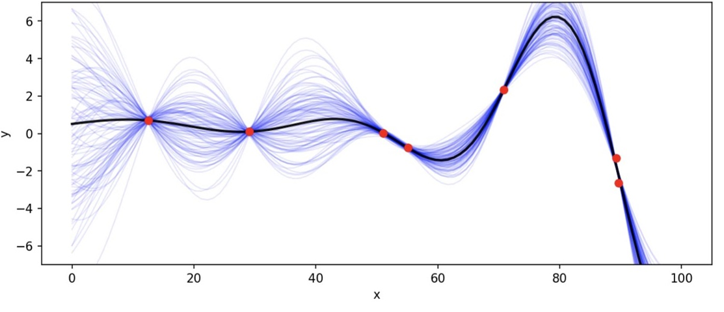
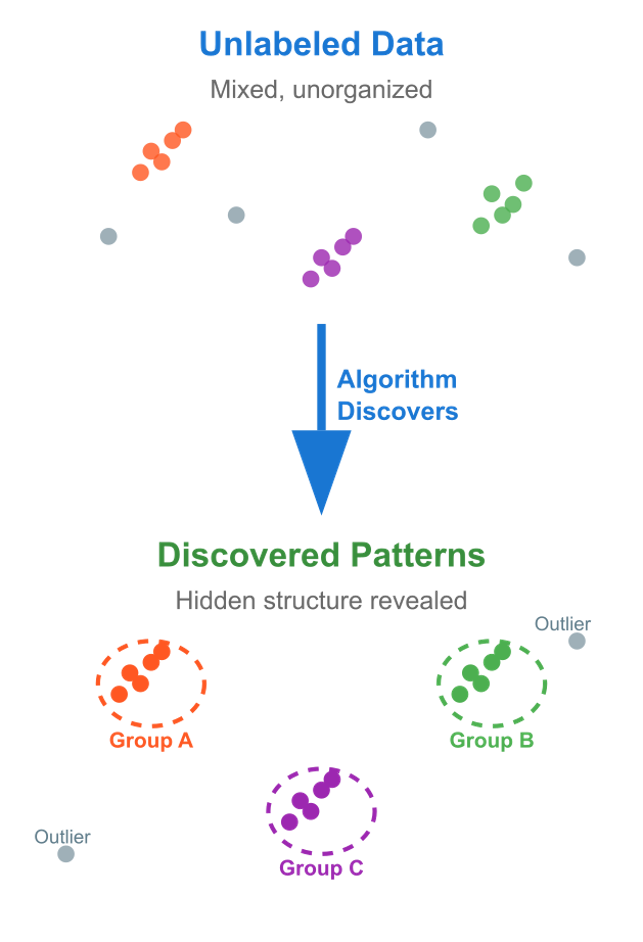
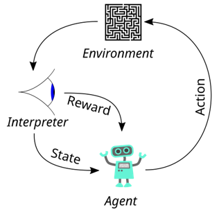

# Types of ML systems

Several criteria may be used to group ML systems.

Whether they are trained under human supervision:

- Supervised
- Unsupervised 
- Semisupervised 
- Reinforcement Learning

Whether they learn incrementally:

- Online
- Batch

Whether they work by comparing new data points to known data points, or instead detect patterns in the training data and build a predictive model, much like scientists do:

- Instance-based
- Model-based learning 

# Supervised/unsupervised

## Supervised learning

The training set you feed to the algorithm includes the desired solutions (labels). Example: classification.
Regression algorithms can be used for classification as well, and vice-versa. For example, Logistic Regression is commonly used for classification, as it can output a value that corresponds to the probability of belonging to a given class.

In supervised learning we are not particularly interested in fitting the observed data very well, but rather in generalizing well to unseen data. The figure shows many curves that perfectly fit the data, however the black curve generalizes better.

Examples: 
- k-Nearest Neighbors
- Linear Regression
- Logistic Regression
- Support Vector Machines (SVMs)
- Decision Trees and Random Forests
- Neural networks (can be other types too)

## Unsupervised learning

Training data is not labeled.

Examples: 
- Clustering 
	- K-Means
	- DBSCAN
	- Hierarchical Cluster Analysis (HCA)
- Anomaly detection and novelty detection 
	- One class SVM
	- Isolation Forest
- Visualization and dimensionality reduction
	- Principal Component Analysis (PCA)
	- Kernel PCA
	- Locally-Linear Embedding (LLE)
	- t-distributed Stochastic Neighbor Embedding (t-SNE)
- Association rule learning
	- Apriori
	- Eclat

## Semisupervised learning

Some data is labeled, other is not. Some algorithms can deal with this. They are usually combinations of supervised and unsupervised algorithms.

Examples:
- Deep belief networks (DBNs) - based on unsupervised components called restricted Boltzmann machines (RBMs) stacked on top of one another. RBMs are trained sequentially in an unsupervised manner, and then the whole system is fine-tuned using supervised learning techniques

## Reinforcement learning

Learns through interaction with an environment via trial and error. The algorithm receives rewards or penalties for actions and learns to maximize cumulative reward. 

## Hybrid modelling

The central questions about hybrid modelling are: should we discard all the physical knowledge acquired for centuries and replace it by data-driven models? Is there a way to combine both? Is it beneficial to do so?
In general, the term hybrid modelling refers to the combination of mechanistic and data-driven models and is also called "grey-box modelling". For example, mass and energy balances, thermodynamic laws and kinetics should be respected in our models. Introducing this physical knowledge reduces the amount of data that is needed for the ML part and improves the capacity of the models to generalize to unseen conditions.
