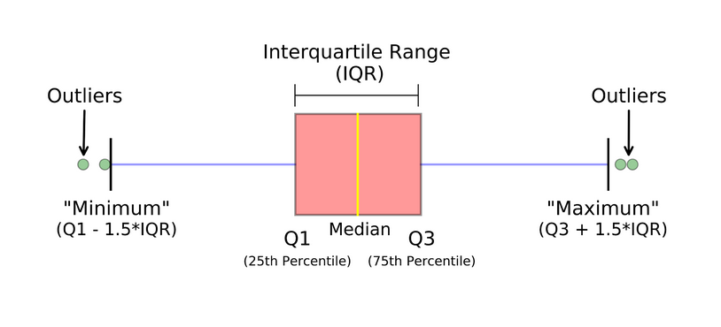

# Boxplots

A box and whisker plot—also called a box plot—displays the five-number summary of a set of data. The five-number summary is the minimum, first quartile, median, third quartile, and maximum.




## Definitions

**Minimum** - The lowest value, excluding outliers (shown at the end of the left whisker).

**Lower Quartile** - Twenty-five percent of scores fall below the lower quartile value (also known as the first quartile).

**Median** - The median marks the mid-point of the data and is shown by the line that divides the box into two parts (sometimes known as the second quartile). Half the values are greater than or equal to this value, and half are less.

**Upper Quartile** - Seventy-five percent of the values fall below the upper quartile value (also known as the third quartile). Thus, 25% of data are above this value.

**Maximum** - The highest value, excluding outliers (shown at the end of the right whisker).

**Whiskers** - The upper and lower whiskers represent scores outside the middle 50% (i.e., the lower 25% of scores and the upper 25% of scores).

**Interquartile Range (or IQR)** - The box plot shows the middle 50% of scores (i.e., the range between the 25th and 75th percentile).

## Outliers 

Outside 1.5 times the interquartile range above the upper quartile and below the lower quartile:

$$\text{Q1} – 1.5 * \text{IQR}$$ 

or 

$$\text{Q3} + 1.5 * \text{IQR}$$


## Creating a boxplot in `Pandas`

```python
df = pd.DataFrame(
    np.random.randn(10, 4),
    columns=['Col1', 'Col2', 'Col3', 'Col4']
)

boxplot = df.boxplot(column=['Col1', 'Col2', 'Col3'])  
```

## References

- [Box Plot Explained: Interpretation, Examples, & Comparison](https://www.simplypsychology.org/boxplots.html)