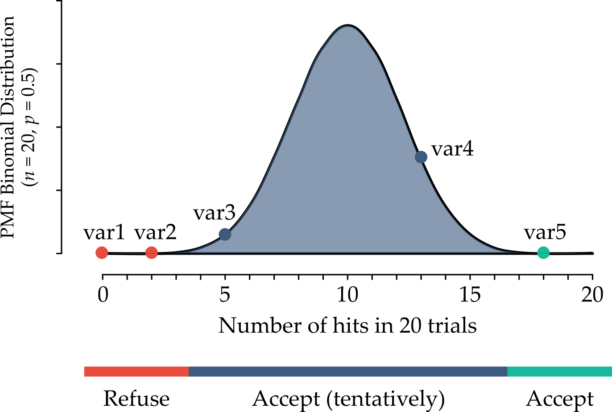

# Feature selection

Consider the following case. The [RDkit](https://www.rdkit.org/) software can generate descriptors based on the molecular structure of compounds. It generates descriptors from the simplified molecular-input line-entry system (SMILES, a method of describing the chemical structure by string).

RDkit generates 200 descriptors. However, some of them are not effective (e.g., all values are the same for all compounds, the correlation coefficient with the target is almost zero, etc.). Therefore, some pretreatments can be conducted : 
- exclude features of standard deviation for all data points = 0 (all data points have the same value in the descriptor).
- exclude features whose correlation coefficient is below a defined threshold (e.g., < 0.1).
- select features using [Boruta](https://towardsdatascience.com/boruta-explained-the-way-i-wish-someone-explained-it-to-me-4489d70e154a). Boruta is a software that can select features. It iteratively removes the features that are proved by a statistical test to be less relevant than random probes. 

There are many different feature selection methods in machine learning, each with its own strengths and weaknesses. The most common types/groups feature selection methods are:

1.  **Filter methods:** These methods rank features based on statistical measures such as correlation or mutual information with the target variable, and then select the top-k features. Examples include chi-square test, mutual information, correlation-based feature selection, and variance threshold.

2.  **Wrapper methods:** These methods evaluate subsets of features using a specific machine learning model to select the best subset that maximizes model performance. Examples include recursive feature elimination, forward selection, and backward elimination.

3.  **Embedded methods:** These methods integrate feature selection into the process of building a machine learning model. The feature selection process is part of the model training process, and the algorithm learns which features are most important during model training. Examples include LASSO, Elastic Net, and Ridge regression.

4.  **Dimensionality reduction methods:** These methods transform the original high-dimensional feature space into a lower-dimensional space by combining the original features. Examples include principal component analysis (PCA), linear discriminant analysis (LDA), and t-distributed stochastic neighbor embedding (t-SNE).

5.  **Hybrid methods:** These methods combine multiple feature selection methods to overcome the limitations of each method. Examples include Boruta, which combines filter and wrapper methods, and genetic algorithms, which combine wrapper and embedded methods.

It is important to note that the choice of feature selection method will depend on the specific problem and the data set being used. It is often necessary to try multiple methods and compare their results to find the best feature subset for a given task.

In the following sections some methods are explained in greater detail.

## Collinearity

\[TO DO\]

## Selection by model importance

A popular algorithm for feature selection is scikit-learn [SelectFromModel](https://scikit-learn.org/stable/modules/generated/sklearn.feature_selection.SelectFromModel.html#sklearn.feature_selection.SelectFromModel). The SelectFromModel selects a subset of features based on the importance scores of a selected base model that is capable of capturing non-linear relationships and interactions, e.g. a Random Forest. It works by training a model on the entire set of features and then selecting a subset of features based on their importance score as determined by the base model.

The algorithm first trains the base estimator on the entire feature set and calculates a feature importance score for each feature. The importance scores can be calculated in different ways depending on the type of estimator used, but typically involve measuring how much each feature contributes to the model’s performance.

The algorithm then selects a subset of features by setting a threshold on the importance scores. Only the features with importance scores greater than or equal to the threshold are selected for the final feature set.

### Advantages

The advantage of the SelectFromModel algorithm is that it is model-agnostic and can work with any estimator that can provide a feature importance metric or a coefficient attribute, such as Decision Trees, Random Forests, Logistic Regression, and Support Vector Machines. It can also be used in conjunction with any other pre-processing technique such as scaling, normalization, or encoding.

### Drawbacks

The weak spot of such an approach is: who determines the threshold, and how? There is a good deal of arbitrariness in it. Additionally, it is important to note that the selected subset of features may not be the optimal set for all types of models or data sets, and that it is still recommended to experiment with different feature selection techniques to find the best set of features for a given problem.

## Recursive feature elimination

Recursive feature elimination (RFE) is an iterative algorithm that recursively removes features from the data set and evaluates the performance of the model on the remaining features. By removing the least important feature at each iteration, the algorithm can identify the most important features for the given task. The RFE algorithm works as follows:

1.  Select the machine learning model that will be used for feature selection. Any model that can attribute a weight or importance to a feature can be used.

2.  The model is trained on all features to establish a baseline performance.

3.  Features are ranked based on the weight/importance attributed by the model.

4.  Remove the least important feature from the data set.

5.  Train the model on the reduced set of features.

6.  Evaluate the performance of the model on the remaining features to determine whether the performance has improved or worsened compared to the baseline performance.

7.  Repeat steps 3-6 until a desired number of features or a desired level of performance is achieved.

### Drawbacks

It can be computationally expensive, especially for data sets with a large number of features.

## Boruta

The Boruta method was proposed by Kursa and Rudnicki in 2010 as a way to identify relevant features in data sets with many irrelevant or redundant variables. The Boruta algorithm works by comparing the importance of each variable in the original data set to the importance of a set of shadow variables created by shuffling the values of each feature.

Then, a Random Forest model is trained on the database with the original and shadow variables, and the importance of each feature is extracted. A threshold is defined as the highest importance recorded among the shadow features. The algorithm then compares the importance of each original variable against the threshold, and if the original variable has a higher importance score, it is considered a "hit" and kept as a relevant feature. The idea is that a feature is useful only if it is capable of doing better than the best randomized feature.

This process is repeated iteratively until all variables have been either confirmed or rejected. Since each independent experiment can give a binary outcome ("hit" or "no hit"), a series of *n* trials follows a binomial distribution (see the Figure below). 

The Boruta method does not set a hard threshold between a refusal and an acceptance area. Instead, there are 3 areas:

- area of refusal: the features in this area are considered as noise, so they are dropped;

- area of irresolution: the Boruta method is indecisive about the features that are in this area. It is up to the user whether to select then or not;

- area of acceptance: the features in this area are considered predictive, so they are kept in the model.

The areas are defined by selecting the two most extreme portions of the distribution called tails of the distribution (usually each tail
accounts for 0.5 % of the distribution). 
To summarize, the Boruta method is based in two ideas: first, features do not compete among themselves. Instead they compete with a randomized version of them. Second, a series of *n* trials (comparisons between original and shadow features) follows a binomial distribution. 

### Advantages

One advantage of the Boruta method is that it is able to handle correlated features, which can cause problems for other feature selection methods. Another advantage is that it is able to identify not only the most important features, but also the interactions between them.

### Drawbacks

One potential drawback of the Boruta method is that it can be computationally expensive, especially for large data sets with many variables. Additionally, it requires tuning of several hyperparameters, such as the number of trees in the random forest and the significance level for comparing the importance scores of the original features and their shadow variables.

## References

- [Recursive feature elimination article](https://machinelearningmastery.com/rfe-feature-selection-in-python/)
- [Boruta Github](https://github.com/scikit-learn-contrib/boruta_py)
- [Boruta Paper](https://www.jstatsoft.org/article/view/v036i11)
- [Boruta Article](https://danielhomola.com/feature%20selection/phd/borutapy-an-all-relevant-feature-selection-method/)