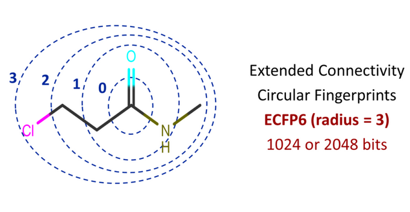

# Morgan ECFP fingerprints

In Extended Connectivity FingerPrinting (ECFP), you iterate for each atom of the molecule and retrieve all possible molecular routes from that atom based on a specified radius. Figure 1 shows a graphical illustration of radii or bond depths based on the carbon atom from the carbonyl functional group. Radius 2 (ECFP4) and radius 3 (ECFP6) are commonly used. For a smaller radius, you will extract smaller fragments, and for a larger radius, you will extract larger fragments.

Essentially, it will extract information on substructures containing circular atom neighborhoods such as an atom and its connectivity to immediate neighbors and then neighbors of those neighbors.

Note that each bit position in ECFP indicates the presence or absence of particular substructures as in MACCS and other molecular fingerprints. ECFP fingerprints are not predefined thus they are also known as implicit fingerprints. 




## Computing Morgan ECFPx

To compute Morgan Fingerprint (ECFPx) use `AllChem.GetMorganFingerprintAsBitVect`. ECFP6 fingerprint for each molecule has 1024 bits. In the following `df['ROMol']` is the column containning the molecule `rdchem.Mol` object.

```python
from rdkit.Chem import AllChem

radius=3
nBits=1024

ECFP6 = [AllChem.GetMorganFingerprintAsBitVect(x,radius=radius, nBits=nBits) for x in df['ROMol']]

ecfp6_lists = [list(l) for l in ECFP6]

ecfp6_name = [f'ECFP_{i}' for i in range(nBits)]

ecfp6_df = pd.DataFrame(ecfp6_lists, index=df.index, columns=ecfp6_name)

ecfp6_df.shape
# (8221, 1024)
```

The `radius` is usually set 2 for similarity search and 3 for machine learning. For the number of bits (`nBits`) the default is 2048. 1024 is also widely used.


## References

- [Extended-Connectivity Fingerprints](https://pubs.acs.org/doi/10.1021/ci100050t)

- [Introduction to Extended Connectivity FingerPrinting (ECFP)](https://towardsdatascience.com/a-practical-introduction-to-the-use-of-molecular-fingerprints-in-drug-discovery-7f15021be2b1)