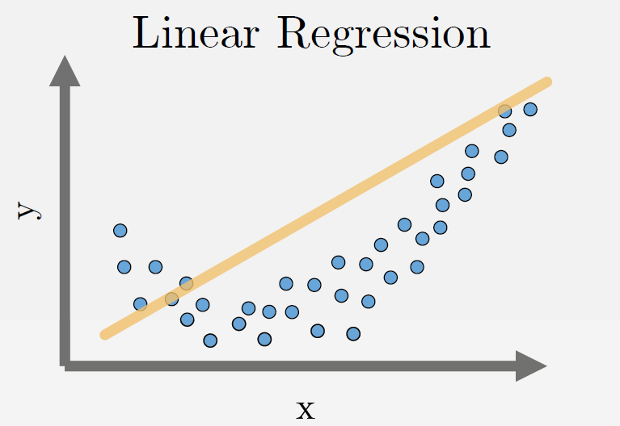
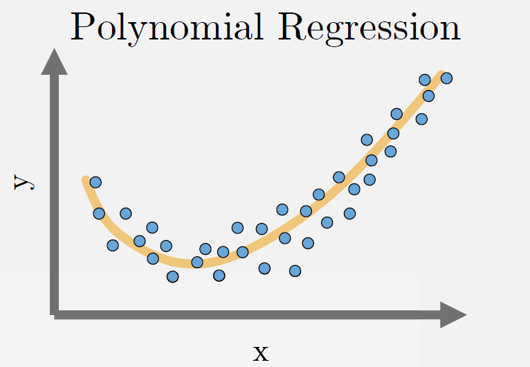
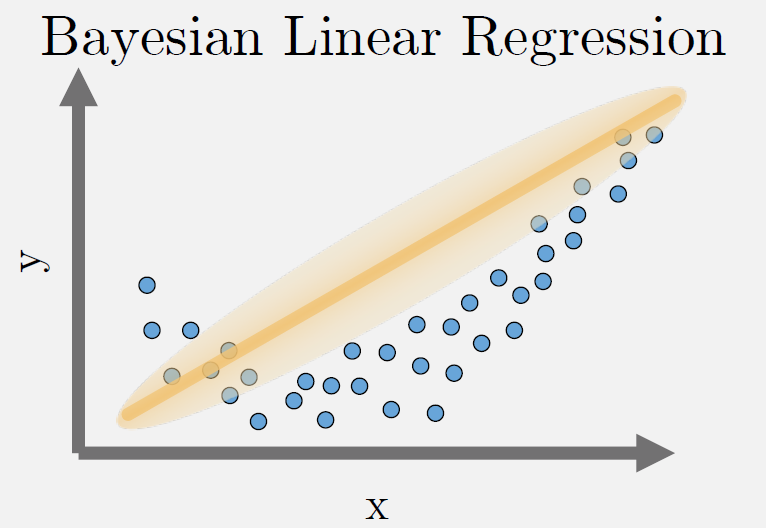
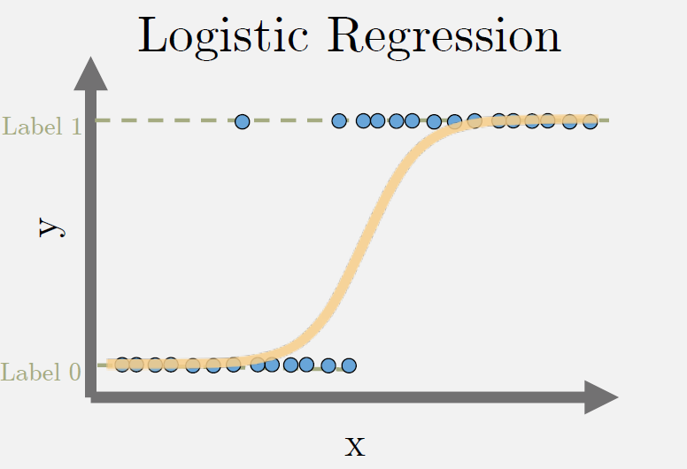

# Linear models

Fitting a function $f(.)$ to datapoints $y_i=f(x_i)$ under some error function. Based on the estimated function and error, we have the following types of regression.

## Linear Regression
Fits a line minimizing the sum of mean-squared error for each datapoint.

$$
min_{\beta} \sum_{i} (y_i - f_{\beta}^{linear})^2
$$

$$f_{\beta}^{linear}(x_i) = \beta_0 + \beta_1 x_i$$




```{toctree}
linear-regression
```


## Polynomial Regression
Fits a polynomial of order $k$ ($k+1$ unknowns) minimizing the sum of mean-squared error for each datapoint.

$$min_{\beta} \sum_{i} (y_i - f_{\beta}^{poly})^2$$

$$f_{\beta}^{poly}(x_i) = \beta_0 + \beta_1 x_i + \beta_2 x_i^2 + ... + \beta_k x_i^k$$



## Bayesian Regression
For each datapoint, fits a gaussian distribution by minimizing the mean-squared error. As the number of data points xi increases, it converges to point estimates i.e. $n \rightarrow \infty, \sigma^2 \rightarrow 0$

$$min_{\beta} \sum_{i} [y_i - \mathcal{N}(f_{\beta}(x_i), \sigma^2)]^2$$

where $\mathcal{N}(\mu, \sigma^2)$ is a Gaussian distribution with mean $\mu$ and variance $\sigma^2$

$$f_{\beta}(x_i) = f_{\beta}^{linear}(x_i) \quad \mathrm{or} \quad f_{\beta}^{poly}(x_i)$$



## Ridge Regression
Can fit either a line, or polynomial minimizing the sum of mean-squared error for each datapoint and the weighted L2 norm of the function parameters beta.

## LASSO Regression
Can fit either a line, or polynomial minimizing the the sum of mean-squared error for each datapoint and the weighted L1 norm of the function parameters beta.

## Logistic Regression
Can fit either a line, or polynomial with sigmoid activation minimizing the binary cross-entropy loss for each datapoint. The labels y are binary class labels.



