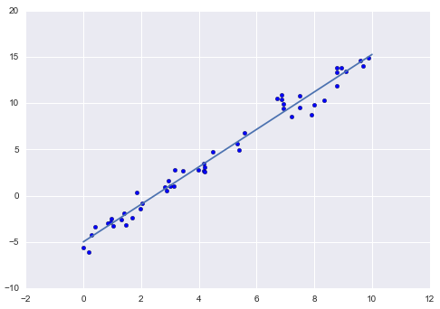

## Linear regression

Linear regression models are a good starting point for regression tasks. They can be fit very quickly, and are very interpretable.


## Fit a simple linear regression to 2D data

A straight-line fit is a model of the form:

$$y=ax+b$$

where $a$ is commonly known as the slope, and $b$ is commonly known as the intercept.

We can use Scikit-Learn's [`LinearRegression`](https://scikit-learn.org/stable/modules/generated/sklearn.linear_model.LinearRegression.html) to fit this data:

```python
from sklearn.linear_model import LinearRegression

model = LinearRegression(fit_intercept=True)

model.fit(x, y)

xfit = np.linspace(0, 10, 1000)
yfit = model.predict(xfit)

plt.scatter(x, y)
plt.plot(xfit, yfit);
```




## Multilinear regression

The `LinearRegression` estimator can also handle multidimensional linear models of the form:

$$y = a_0 + a_1 x_1 + a_2 x_2 + ...$$

where there are multiple $x$ values. Geometrically, this is akin to fitting a plane to points in three dimensions, or fitting a hyper-plane to points in higher dimensions.


## Adapting linear regression to nonlinear relationships

The idea is to take our multidimensional linear model:

$$y = a_0 + a_1 x_1 + a_2 x_2 + ...$$

and build the $x_1$, $x_2$, $x_3$, and so on, from our single-dimensional input $x$. That is, we let $x_n = f_n(x)$, where $f_n(x)$ is some function that transforms our data.

For example, if $f_n(x) = x^n$, our model becomes a polynomial regression:

$$y = a_0 + a_1 x + a_2 x^2 + a_3 x^3 + ...$$

This is still a linear model, as the linearity refers to the fact that the coefficients $a_n$ never multiply or divide each other. What we have done is taken our one-dimensional $x$ values and projected them into a higher dimension, so that a linear fit can fit more complicated relationships between $x$ and $y$.

Using Scikit-Learn's [`PolynomialFeatures`](https://scikit-learn.org/stable/modules/generated/sklearn.preprocessing.PolynomialFeatures.html) we can generate a new feature matrix consisting of all polynomial combinations of the features with degree less than or equal to the specified degree. For example, if an input sample is two dimensional and of the form $[a, b]$, the second degree polynomial features are $[1, a, b, a^2, ab, b^2]$.

```python
from sklearn.preprocessing import PolynomialFeatures

x = ...  # colunm vector

poly = PolynomialFeatures(2, include_bias=False)
poly.fit_transform(x)
```
