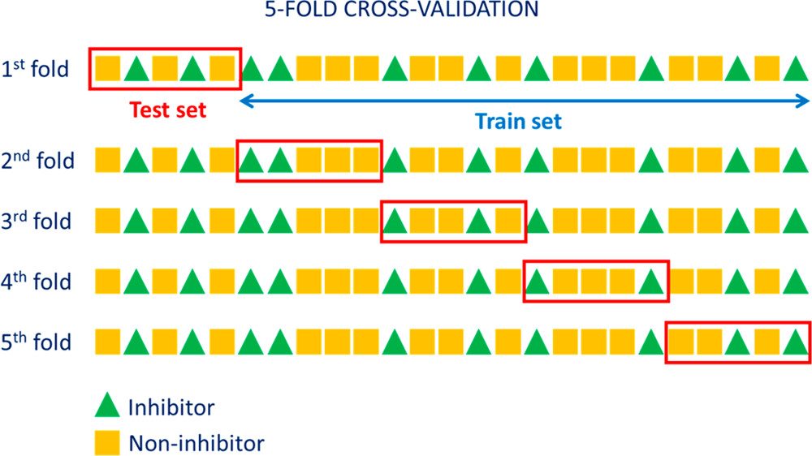

# Train and cross validation

In 5-fold cross-validation, each algorithm is tested five times against five independent test samples corresponding to 20% of the data set after the model is also trained five different times against the remaining 80%.

k = 5 and k = 10 are enough to avoid bias towards the validation dataset

Training dataset: Fit model parameters

Validation dataset: Tune parameters

Test dataset: Evaluate model performance

## References

- [Elucidating Structure–Property Relationships in Aluminum Alloy Corrosion Inhibitors by Machine Learning](https://doi.org/10.1021/acs.jpcc.9b09538)

- [Prediction error estimation: a comparison of resampling methods](https://doi.org/10.1093/bioinformatics/bti499)